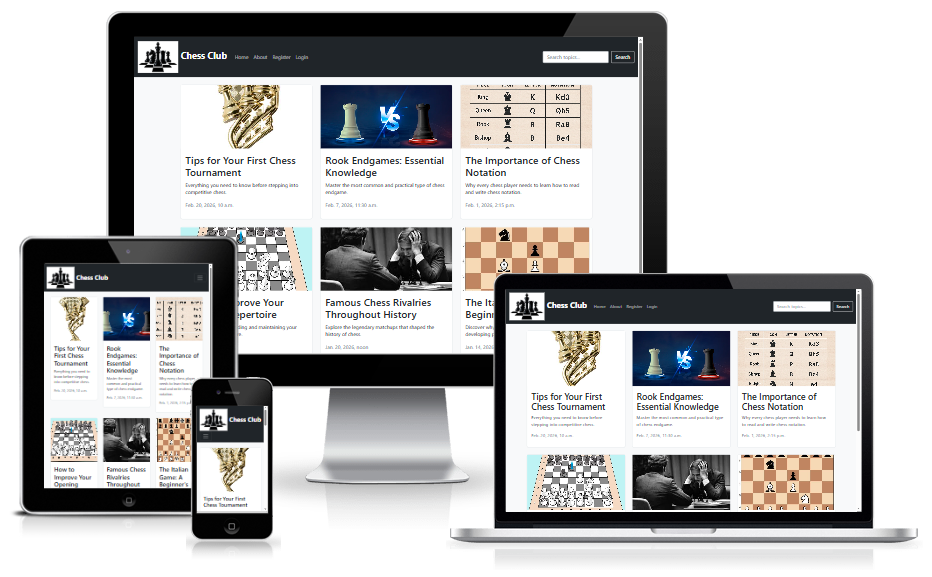
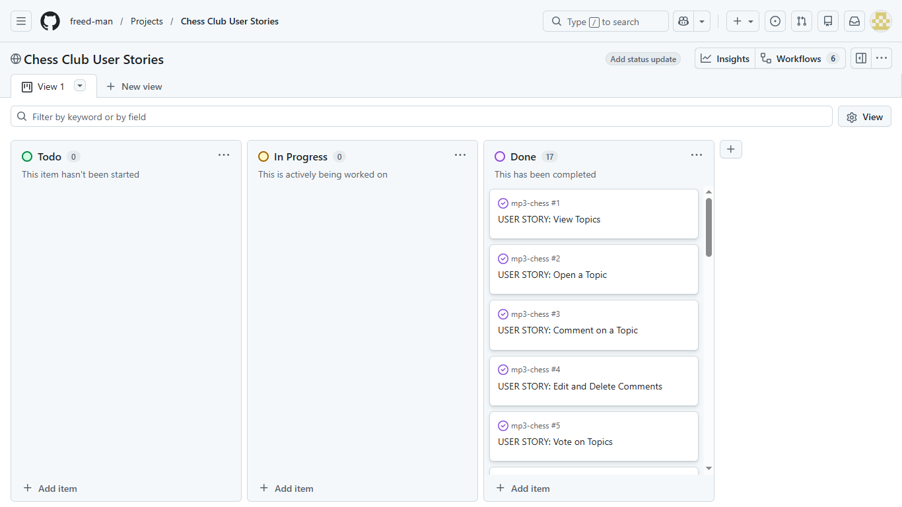
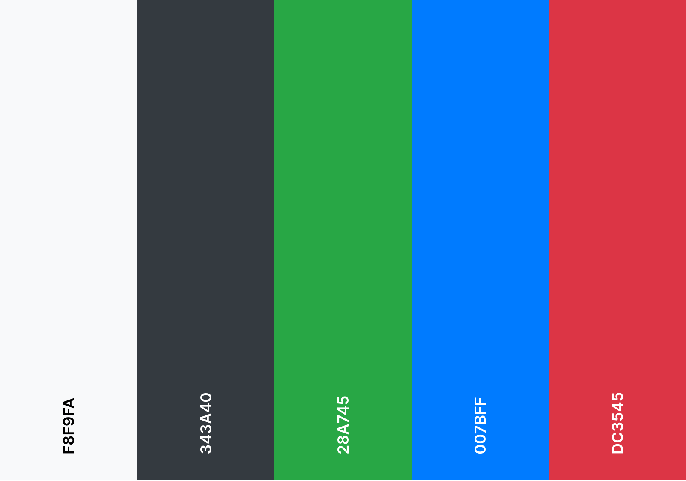

# Chess Club — Community Website

A Django-based community website for chess enthusiasts to read articles, track games, interact through comments and votes, and connect with fellow players.

Link to the live site: [Chess Club](https://chess-club-c940b2bc0cf9.herokuapp.com/)



## Table of Contents

1. [**User Experience (UX)**](#user-experience-ux)
   - [Project Purpose](#project-purpose)
   - [Target Audience](#target-audience)
   - [User Stories](#user-stories)
   - [Agile Methodology](#agile-methodology)
   - [Design](#design)
   - [Wireframes](#wireframes)
   - [Database Schema](#database-schema)
2. [**Features**](#features)
   - [Current Features](#current-features)
   - [Potential Features](#potential-features)
3. [**Project Structure**](#project-structure)
4. [**Technologies Used**](#technologies-used)
5. [**Testing**](#testing)
6. [**Bugs**](#bugs)
   - [Fixed Bugs](#fixed-bugs)
   - [Unfixed Bugs](#unfixed-bugs)
7. [**Deployment**](#deployment)
8. [**Credits**](#credits)

---

## User Experience (UX)

### Project Purpose

Chess Club was built to provide a welcoming online space for chess players of all levels. The site allows a club admin to publish chess-related articles and tutorials, while registered members can engage through comments, vote on content, log their game history, and maintain personal profiles with statistics.

The site owner (admin) benefits by managing the club content, communicating with members via the contact system, and growing an engaged chess community. Members benefit by tracking their progress, connecting with other players, and accessing chess articles and tips.

### Target Audience

- Chess players of all skill levels looking for a club community
- New players wanting to learn through articles and tips
- Competitive players wanting to track their game history and stats
- Club administrators looking to share content and communicate with members

### User Stories

User stories were created and managed using GitHub Issues, tracked via a GitHub Projects Kanban board. Each story includes acceptance criteria and was labelled using MoSCoW prioritisation.

**Site User Stories:**

| # | User Story | MoSCoW | Acceptance Criteria |
|---|-----------|--------|-------------------|
| 1 | As a site user, I can view a paginated list of topics so that I can browse articles easily | Must Have | Topics displayed as cards with images, 6 per page, pagination navigation visible |
| 2 | As a site user, I can click on a topic so that I can read the full article | Must Have | Full article displayed with title, author, date, image, and content |
| 3 | As a site user, I can register an account so that I can access interactive features | Must Have | Registration form works, profile auto-created, user redirected and logged in |
| 4 | As a site user, I can log in and log out so that I can access my account securely | Must Have | Login/logout works with confirmation messages, user state shown in navbar |
| 5 | As a site user, I can leave comments on articles so that I can share my thoughts | Must Have | Comment form visible to logged in users, comment appears after submission |
| 6 | As a site user, I can edit and delete my own comments so that I can manage my contributions | Must Have | Edit/delete buttons visible only on own comments, confirmation modal for delete |
| 7 | As a site user, I can upvote and downvote topics so that I can show my opinion on articles | Should Have | Vote buttons work, toggle on/off, switch between up and down, counts update |
| 8 | As a site user, I can view user profiles so that I can see other members' info and game stats | Must Have | Profile displays photo, bio, skill level, game stats and history |
| 9 | As a site user, I can edit my own profile so that I can keep my information up to date | Must Have | Edit form pre-fills current data, photo uploads to Cloudinary, success message shown |
| 10 | As a site user, I can log chess games so that I can track my playing history | Must Have | Game form with opponent name, date picker, result choice, game appears in history |
| 11 | As a site user, I can edit and delete my own games so that I can correct mistakes | Must Have | Edit pre-fills form, delete prompts confirmation, game list updates |
| 12 | As a site user, I can delete my account so that I can remove all my data from the site | Should Have | Confirmation modal shown, all related data removed on confirm |
| 13 | As a site user, I can search articles by keyword so that I can find specific topics | Should Have | Search input in navbar, results page shows matching topics or "no results" message |
| 14 | As a site user, I can submit a contact form so that I can reach the club admin | Should Have | Form with name, email, category, message fields, success message on submission |
| 15 | As a site user, I can click opponent names in my game history so that I can visit their profiles | Could Have | Opponent names link to profile if they are a registered user, plain text otherwise |

**Site Admin Stories:**

| # | User Story | MoSCoW | Acceptance Criteria |
|---|-----------|--------|-------------------|
| 16 | As a site admin, I can create, edit, and publish articles so that I can manage club content | Must Have | Admin panel with rich text editor, draft/published status, featured images |
| 17 | As a site admin, I can view and manage contact requests so that I can respond to members | Should Have | Contact requests listed in admin panel with read/unread filtering |

The full project board can be viewed here: [GitHub Projects Board](https://github.com/users/freed-man/projects/2)

### Agile Methodology

This project was developed using Agile methodology. A GitHub Projects Kanban board was used to track 17 user stories through **Todo**, **In Progress**, and **Done** columns.

Each user story was created as a GitHub Issue with a clear title, description, acceptance criteria, and MoSCoW priority label. Stories were prioritised as follows:

- **Must Have** — core features essential for the site to function (viewing/reading topics, CRUD on comments and games, user authentication, profiles, admin content management)
- **Should Have** — important features that add significant value (voting, search, contact form, account deletion)
- **Could Have** — nice extras if time allowed (clickable opponent profiles in game history)

All 17 user stories were completed and moved to the Done column.

<details>
  <summary>View Kanban board screenshot</summary>

  

</details>

### Design

**Colour Scheme**

- Light grey background (#f8f9fa) for a clean, modern feel
- Dark navbar and buttons (#343a40) for strong contrast and professional look
- Green (#28a745) for wins in game stats
- Blue (#007bff) for draws in game stats
- Red (#dc3545) for losses in game stats
- Consistent Bootstrap colour classes used throughout for maintainability

<details>
  <summary>View colour palette</summary>

  

</details>

**Typography**

- Segoe UI as the primary font with Tahoma, Geneva, Verdana, and sans-serif as fallbacks
- Clear heading hierarchy (h1–h5) for readability and accessibility compliance
- Bold text for stats and key information to draw attention

**Layout**

- Responsive design using Bootstrap 5 grid system
- Card-based layout for topics on the homepage with featured images
- Clean profile pages with centered layout, game stats sidebar, and tabulated game history
- Collapsible contact form on the about page using Bootstrap collapse
- Mobile-first approach — images reorder above content on mobile, columns stack properly
- Consistent spacing and margins across all pages

**User Interface Decisions**

- Auto-dismissing alert messages (3 seconds) keep the interface clean and unobtrusive
- Confirmation modals for destructive actions (delete comment, delete account) prevent accidental data loss
- Show/hide password toggle on login and signup forms for usability
- Date picker widgets on date fields instead of manual text input
- Colour-coded game results (green/blue/red) for quick visual scanning
- Clickable usernames and opponent names throughout the site for easy navigation
- "Log in to leave a comment" link redirects back to the article after login using a hidden `next` field
- POST-redirect-GET pattern on all forms to prevent duplicate submissions on page refresh

### Wireframes

Wireframes were created during the planning phase to outline the layout and structure of key pages.

<details>
  <summary>Homepage</summary>
  <p>Add wireframe image here</p>
</details>

<details>
  <summary>Topic Detail</summary>
  <p>Add wireframe image here</p>
</details>

<details>
  <summary>Profile Page</summary>
  <p>Add wireframe image here</p>
</details>

<details>
  <summary>About Page</summary>
  <p>Add wireframe image here</p>
</details>

### Database Schema

The project uses a PostgreSQL relational database with 8 custom models plus Django's built-in User model.

**Entity Relationship Diagram:**

<details>
  <summary>View ERD</summary>
  <p>Add ERD image here</p>
</details>

**Models Overview:**

| Model | App | Description |
|-------|-----|-------------|
| User | Django built-in | Handles authentication — username, email, password |
| Profile | profiles | Extends User with OneToOneField — photo, bio, skill level, date of birth, gender |
| Topic | club | Stores articles — title, slug, content, featured image, status (draft/published), excerpt |
| Comment | club | Stores user comments on topics — body, created date |
| Vote | club | Stores upvotes/downvotes — vote type (+1 or -1), unique together per user per topic |
| Game | profiles | Stores chess game records — opponent name, date played, result (Win/Draw/Loss) |
| About | about | Stores club information — title, content, image, location, contact email |
| ContactRequest | about | Stores contact form submissions — name, email, category, message, read status |

**Key Relationships:**

| Relationship | Type | Description |
|-------------|------|-------------|
| User → Profile | One to One | Each user has exactly one profile, auto-created via Django signal on registration |
| User → Topics | One to Many | Admin creates articles linked to their account |
| User → Comments | One to Many | Users can comment on multiple topics |
| User → Votes | One to Many | Users can vote on multiple topics |
| User → Games | One to Many | Users log their own game history |
| Topic → Comments | One to Many | Each topic can have many comments |
| Topic → Votes | One to Many | Each topic can have many votes |

**Design Decisions:**

- The Vote model uses `unique_together` on user and topic to prevent duplicate voting, while allowing users to toggle or switch their vote
- The Game model uses a text field for `opponent_name` rather than a ForeignKey, allowing users to log games against opponents who are not registered on the site
- Profile is auto-created using Django signals (`post_save` on User) so new registrations always have a profile ready
- `on_delete=models.CASCADE` ensures all related data is removed when a user deletes their account
- Comments do not require admin approval (unlike the CodeStar walkthrough) to keep community interaction more immediate

---

## Features

### Current Features

<details>
  <summary>Homepage with Topic Cards — browse published articles with featured images, titles, excerpts, and pagination (6 per page)</summary>
  <p>Add screenshot here</p>
</details>

<details>
  <summary>Topic Detail Page — read full articles with featured images positioned to the right on desktop and top on mobile, voting buttons with live counts, and comments section</summary>
  <p>Add screenshot here</p>
</details>

<details>
  <summary>User Registration — sign up with username, email, and password with show/hide password toggle</summary>
  <p>Add screenshot here</p>
</details>

<details>
  <summary>Login/Logout — secure authentication with redirect back to previous page after login via hidden "next" field</summary>
  <p>Add screenshot here</p>
</details>

<details>
  <summary>Comments (Full CRUD) — create, edit, and delete own comments with confirmation modals and edit button that populates the form</summary>
  <p>Add screenshot here</p>
</details>

<details>
  <summary>Voting System — upvote and downvote topics, toggle votes on/off, switch between up and down, disabled buttons for logged-out users</summary>
  <p>Add screenshot here</p>
</details>

<details>
  <summary>User Profiles — view profile photo, bio, skill level, date of birth, and game stats (colour-coded wins/draws/losses) with game history table</summary>
  <p>Add screenshot here</p>
</details>

<details>
  <summary>Edit Profile — update photo (via Cloudinary), bio, skill level, date of birth, and gender with pre-filled form</summary>
  <p>Add screenshot here</p>
</details>

<details>
  <summary>Game Logging (Full CRUD) — log games with opponent name, date picker, and result. Edit and delete own game records</summary>
  <p>Add screenshot here</p>
</details>

<details>
  <summary>Clickable Opponents — opponent names in game history link to their profiles if they are registered users, plain text otherwise</summary>
  <p>Add screenshot here</p>
</details>

<details>
  <summary>Search — find articles by keyword in title or content, with results page and message if no results found</summary>
  <p>Add screenshot here</p>
</details>

<details>
  <summary>About Page — club information with image, location, contact email, and collapsible contact form</summary>
  <p>Add screenshot here</p>
</details>

<details>
  <summary>Contact Form — submit messages with name, email, category dropdown (Question/Comment/Request/Technical Issue), and message body</summary>
  <p>Add screenshot here</p>
</details>

<details>
  <summary>Account Deletion — delete account with confirmation modal, cascade removes all related data (profile, games, comments, votes)</summary>
  <p>Add screenshot here</p>
</details>

<details>
  <summary>Auto-Dismissing Alerts — success and error messages fade out after 3 seconds using JavaScript setTimeout</summary>
  <p>Add screenshot here</p>
</details>

<details>
  <summary>Admin Panel — rich text editor (Summernote) for articles, manage topics with draft/published status, manage users, comments, votes, games, and contact requests with read/unread filtering</summary>
  <p>Add screenshot here</p>
</details>

<details>
  <summary>Responsive Design — fully responsive on mobile, tablet, and desktop with proper column stacking and image reordering</summary>
  <p>Add screenshot here</p>
</details>

### Potential Features

- **User-submitted articles** — allow registered users to submit articles for admin approval
- **Email verification** — require email confirmation on registration
- **Password reset** — allow users to reset forgotten passwords via email
- **Notification system** — notify users when someone comments on a topic they voted on
- **Player rankings/leaderboard** — rank users by win percentage or total games
- **Tournament organiser** — allow admins to create and manage club tournaments
- **Direct messaging** — private messaging between club members
- **Game analysis** — allow users to add notes and detailed analysis to logged games
- **Profile badges** — award badges for milestones (e.g. 10 wins, 50 comments, 100 games)
- **Opponent autocomplete** — dropdown of registered usernames when logging a game
- **Advanced game stats** — win percentage, current streak, most frequent opponent

---

## Project Structure

The project follows Django best practices by separating concerns into three distinct apps:

| App | Purpose |
|-----|---------|
| **club** | Core blog functionality — topics (articles), comments, and voting. Handles the main content that site visitors interact with |
| **profiles** | User profile management and game logging. Handles all personal user data including bio, photo, skill level, and game history |
| **about** | Static content and contact functionality. Handles the About page content and the contact form/requests |

Each app contains its own models, views, URLs, forms, templates, admin configuration, and test files, keeping the codebase modular and maintainable. The project-level `chess/` directory contains settings, root URL configuration, and WSGI/ASGI entry points.

**Key architectural patterns used:**
- Class-based views for list pages (e.g. `TopicList` using `ListView`)
- Function-based views for custom logic (e.g. `topic_detail`, `vote_topic`, `profile_view`)
- Django signals for automatic Profile creation on user registration
- Template inheritance with a shared `base.html` for consistent layout
- Crispy Forms for consistent, Bootstrap-styled form rendering across all apps

---

## Technologies Used

**Languages:**
- HTML5
- CSS3
- JavaScript (ES6)
- Python 3

**Frameworks & Libraries:**
- Django 4.2 (LTS) — Python web framework
- Bootstrap 5 — responsive front-end framework
- Crispy Forms & Crispy Bootstrap5 — styled Django forms
- Django AllAuth — authentication (register, login, logout)
- Django Summernote — rich text editor in admin panel
- Cloudinary & dj3-cloudinary-storage — cloud-based image hosting and storage
- WhiteNoise — static file serving in production
- Gunicorn — Python WSGI HTTP server for Heroku deployment
- dj-database-url — database URL parsing for PostgreSQL
- psycopg2 — PostgreSQL database adapter
- Font Awesome 5 — icons for voting buttons, comment counts, and social media

**Database:**
- PostgreSQL (production — via Code Institute database server)
- SQLite (automated testing — configured in settings.py)

**Tools & Services:**
- Git & GitHub — version control and repository hosting
- GitHub Projects — Agile project management with Kanban board
- Heroku — cloud deployment platform
- Cloudinary — image hosting CDN
- CI Python Linter — Python PEP8 validation
- W3C Markup Validator — HTML validation
- W3C CSS Validator — CSS validation
- JSHint — JavaScript validation
- Chrome DevTools & Lighthouse — performance and accessibility testing
- Balsamiq — wireframe design

---

## Testing

Testing documentation has been moved to a separate file for readability.

**[View full testing documentation here → TESTING.md](TESTING.md)**

Summary of testing performed:

- Automated unit tests for forms, views, and models across all three apps (club, profiles, about)
- User story testing to verify all acceptance criteria were met
- Manual testing of all features, user flows, and CRUD operations
- Defensive testing to verify users cannot access or modify other users' data
- Code validation — Python (PEP8), HTML (W3C), CSS (W3C), JavaScript (JSHint)
- Responsive design testing across desktop, laptop, tablet, and mobile
- Browser compatibility testing across Chrome, Firefox, Edge, and Safari
- Lighthouse testing for performance, accessibility, best practices, and SEO

---

## Bugs

### Fixed Bugs

| Bug | Description | Fix |
|-----|------------|-----|
| Duplicate submissions on refresh | Submitting a comment or contact form and refreshing the page would resubmit the data | Implemented POST-redirect-GET pattern — after a successful POST, redirect to the same page with a GET request |
| Login not returning to article | Clicking "log in to leave a comment" would redirect to the homepage after login, not back to the article | Added a hidden `next` field to the login link URL so AllAuth redirects back to the referring page |
| Topic images not appearing on mobile | Featured images were hidden on mobile using `d-none d-md-block` from the walkthrough, so mobile users never saw them | Changed the layout so images appear above the article content on mobile instead of being hidden |
| Profile not created for new users | Newly registered users would get a 500 error when visiting their profile because no Profile object existed | Implemented Django signals (`post_save` on User model) to auto-create a Profile when a new user registers |
| Footer not sticking to bottom | On pages with little content, the footer would float in the middle of the page | Applied `d-flex flex-column min-vh-100` to the body and `mt-auto` to the footer using Bootstrap utility classes |
| Alert messages persisting | Success/error messages remained on screen until manually dismissed | Added JavaScript `setTimeout` function to auto-dismiss alerts after 3 seconds with a fade-out effect |
| Topic images wrong alignment | On the topic detail page, the featured image was not properly aligned with the content column | Adjusted Bootstrap column classes and added responsive image classes to ensure proper scaling and positioning |

### Unfixed Bugs

| Bug | Description | Reason |
|-----|------------|--------|
| Opponent name matching | The clickable opponent feature in game history relies on the opponent name exactly matching a registered username. There is no autocomplete or dropdown, so users must type the username precisely for the link to work | This is a known limitation. An autocomplete dropdown was considered as a future feature but was not implemented in this iteration due to time constraints |
| W3C trailing slash info | The W3C HTML validator shows an informational message about trailing slashes on void elements (e.g. `<br />`, `<input />`). These are generated by Django's template engine and AllAuth | These are informational notices, not errors. They do not affect functionality or accessibility and are generated by third-party libraries |

---

## Deployment

### Heroku Deployment

The project was deployed to Heroku using the following steps:

1. Create a new app on the Heroku dashboard with a unique name
2. In the **Settings** tab, add the following Config Vars:
   - `DATABASE_URL` — PostgreSQL database URL
   - `SECRET_KEY` — Django secret key
   - `CLOUDINARY_URL` — Cloudinary API URL
3. In the **Deploy** tab, connect to the GitHub repository
4. Click **Deploy Branch** (main branch)
5. Once deployed, click **Open App** to view the live site

Important: Ensure `DEBUG = False` in settings.py before final deployment. The `DISABLE_COLLECTSTATIC` config var was removed after static files were properly configured with WhiteNoise.

### Local Development

To run this project locally:

1. Clone the repository:
   ```
   git clone https://github.com/your-username/your-repo.git
   cd your-repo
   ```

2. Create a virtual environment:
   ```
   python -m venv .venv
   source .venv/bin/activate    # Mac/Linux
   .venv\Scripts\activate       # Windows
   ```

3. Install dependencies:
   ```
   pip install -r requirements.txt
   ```

4. Create an `env.py` file in the root directory:
   ```python
   import os

   os.environ.setdefault("DATABASE_URL", "your-database-url")
   os.environ.setdefault("SECRET_KEY", "your-secret-key")
   os.environ.setdefault("CLOUDINARY_URL", "your-cloudinary-url")
   ```

5. Ensure `env.py` is listed in your `.gitignore` file

6. Run migrations:
   ```
   python manage.py migrate
   ```

7. Create a superuser:
   ```
   python manage.py createsuperuser
   ```

8. (Optional) Load fixture data:
   ```
   python manage.py loaddata users profiles topics comments votes games about
   ```

9. Run the development server:
   ```
   python manage.py runserver
   ```

10. Open `http://127.0.0.1:8000/` in your browser

### Forking the Repository

1. Navigate to the GitHub repository
2. Click the **Fork** button in the top right corner
3. This creates a copy in your own GitHub account

### Cloning the Repository

1. Navigate to the GitHub repository
2. Click the **Code** button
3. Copy the URL
4. Open your terminal and run: `git clone <copied-url>`

---

## Credits

### Code & Frameworks

- [Code Institute](https://codeinstitute.net/) — the Django walkthrough project (CodeStar Blog) was used as a learning reference for understanding Django project structure, view patterns, template inheritance, and Heroku deployment steps. All code for this project was written independently and extended significantly beyond the walkthrough
- [Django Documentation](https://docs.djangoproject.com/en/4.2/) — referenced throughout development for models, views, forms, signals, and template tags
- [Django AllAuth Documentation](https://docs.allauth.org/) — authentication setup, template customisation, and login redirect configuration
- [Bootstrap 5 Documentation](https://getbootstrap.com/docs/5.0/) — responsive grid layout, cards, modals, collapse component, navbar, and utility classes
- [Crispy Forms Documentation](https://django-crispy-forms.readthedocs.io/) — form rendering and Bootstrap 5 integration
- [Django Summernote](https://github.com/summernote/django-summernote) — rich text editor for the admin panel
- [Cloudinary Documentation](https://cloudinary.com/documentation) — image upload, storage, and CDN delivery
- [WhiteNoise Documentation](http://whitenoise.evans.io/) — serving static files in production
- Django Cheat Sheet provided by Code Institute — referenced for project setup, deployment, and testing commands

### Content

- All chess article content was written specifically for this project
- User profile biographies are fictional, loosely inspired by real chess grandmaster histories
- Fixture data (users, games, comments, votes) was created for testing and demonstration purposes

### Media

- Default placeholder images are stored in the project's static files directory
- Profile photos and topic featured images are hosted on Cloudinary

### Acknowledgements

- Code Institute for the curriculum, walkthrough projects, assessment criteria, and the Django Cheat Sheet
- The Code Institute Slack community for general support and guidance
