# Testing Documentation — Chess Club

[← Back to README](README.md)

## Table of Contents
1. [**Automated Testing**](#automated-testing)
2. [**Code Validation**](#code-validation)
   - [Python](#python)
   - [HTML](#html)
   - [CSS](#css)
   - [JavaScript](#javascript)
3. [**Manual Testing**](#manual-testing)
   - [Feature Testing](#feature-testing)
   - [Authentication Testing](#authentication-testing)
   - [CRUD Testing](#crud-testing)
   - [Defensive Testing](#defensive-testing)
4. [**Responsive Design Testing**](#responsive-design-testing)
5. [**Browser Compatibility**](#browser-compatibility)
6. [**Lighthouse Testing**](#lighthouse-testing)
7. [**Known Bugs**](#known-bugs)

---

## Automated Testing

Automated unit tests were written using Django's built-in TestCase framework. Tests are run against a temporary SQLite database to avoid affecting production data.

**Running tests:**
```
python manage.py test
```

### Club App — test_club.py

**Model Tests:**
| Test | Description | Result |
|------|------------|--------|
| test_topic_creation | Topic is created with correct fields | ✅ Pass |
| test_topic_str | Topic __str__ returns the title | ✅ Pass |
| test_topic_default_status_is_draft | Default status is 0 (Draft) | ✅ Pass |
| test_topic_default_image | Default featured_image is 'placeholder' | ✅ Pass |
| test_topic_ordering | Topics ordered by -created_on | ✅ Pass |
| test_topic_title_unique | Duplicate titles raise exception | ✅ Pass |
| test_topic_slug_unique | Duplicate slugs raise exception | ✅ Pass |
| test_topic_cascade_delete_with_user | Topics deleted when user is deleted | ✅ Pass |
| test_comment_creation | Comment is created with correct fields | ✅ Pass |
| test_comment_str | Comment __str__ returns expected format | ✅ Pass |
| test_comment_ordering | Comments ordered by created_on ascending | ✅ Pass |
| test_comment_cascade_delete_with_topic | Comments deleted when topic is deleted | ✅ Pass |
| test_comment_cascade_delete_with_user | Comments deleted when user is deleted | ✅ Pass |
| test_vote_creation | Vote is created with correct fields | ✅ Pass |
| test_vote_str | Vote __str__ returns expected format | ✅ Pass |
| test_vote_unique_together | User can only vote once per topic | ✅ Pass |
| test_vote_cascade_delete_with_topic | Votes deleted when topic is deleted | ✅ Pass |

**Form Tests:**
| Test | Description | Result |
|------|------------|--------|
| test_form_has_correct_fields (Comment) | CommentForm only exposes 'body' field | ✅ Pass |
| test_form_valid_data (Comment) | Form valid with body provided | ✅ Pass |
| test_form_empty_body_invalid | Form invalid without body | ✅ Pass |
| test_form_has_correct_fields (Vote) | VoteForm only exposes 'vote_type' field | ✅ Pass |
| test_form_valid_upvote | Form valid with upvote value | ✅ Pass |
| test_form_valid_downvote | Form valid with downvote value | ✅ Pass |

**View Tests:**
| Test | Description | Result |
|------|------------|--------|
| test_homepage_status_200 | Homepage returns HTTP 200 | ✅ Pass |
| test_homepage_uses_correct_template | Homepage renders club/index.html | ✅ Pass |
| test_homepage_only_shows_published | Only published topics appear | ✅ Pass |
| test_homepage_pagination | Homepage paginates at 6 items | ✅ Pass |
| test_homepage_second_page | Second page of pagination works | ✅ Pass |
| test_search_status_200 | Search page returns HTTP 200 | ✅ Pass |
| test_search_uses_correct_template | Search renders search_results.html | ✅ Pass |
| test_search_finds_by_title | Search finds topics by title | ✅ Pass |
| test_search_finds_by_content | Search finds topics by content | ✅ Pass |
| test_search_excludes_drafts | Search does not return draft topics | ✅ Pass |
| test_search_empty_query | Empty query returns no results | ✅ Pass |
| test_search_no_match | Non-matching query returns no results | ✅ Pass |
| test_detail_status_200 | Published topic detail returns HTTP 200 | ✅ Pass |
| test_detail_uses_correct_template | Detail renders topic_detail.html | ✅ Pass |
| test_detail_context | Context contains topic, counts, votes, form | ✅ Pass |
| test_detail_draft_returns_404 | Draft topic returns HTTP 404 | ✅ Pass |
| test_detail_nonexistent_slug_returns_404 | Non-existent slug returns HTTP 404 | ✅ Pass |
| test_detail_user_vote_context_anonymous | user_vote is None for anonymous users | ✅ Pass |
| test_detail_user_vote_context_authenticated | user_vote is populated for logged in users | ✅ Pass |
| test_post_comment_authenticated | Authenticated user can post a comment | ✅ Pass |
| test_post_comment_invalid_data | Invalid comment does not save | ✅ Pass |
| test_vote_redirects_to_detail | Voting redirects to topic detail page | ✅ Pass |
| test_upvote_creates_vote | Upvoting creates a new vote | ✅ Pass |
| test_downvote_creates_vote | Downvoting creates a new vote | ✅ Pass |
| test_toggle_same_vote_removes_it | Voting same type twice removes vote | ✅ Pass |
| test_change_vote_type | Voting different type updates the vote | ✅ Pass |
| test_anonymous_vote_does_not_create | Anonymous users cannot vote | ✅ Pass |
| test_edit_own_comment | User can edit their own comment | ✅ Pass |
| test_cannot_edit_other_users_comment | User cannot edit another user's comment | ✅ Pass |
| test_edit_redirects_to_detail | Editing redirects to topic detail | ✅ Pass |
| test_delete_own_comment | User can delete their own comment | ✅ Pass |
| test_cannot_delete_other_users_comment | User cannot delete another user's comment | ✅ Pass |
| test_delete_redirects_to_detail | Deleting redirects to topic detail | ✅ Pass |

**URL Tests:**
| Test | Description | Result |
|------|------------|--------|
| test_home_url_resolves | Home URL resolves to TopicList | ✅ Pass |
| test_search_url_resolves | Search URL resolves correctly | ✅ Pass |
| test_detail_url_resolves | Detail URL resolves correctly | ✅ Pass |
| test_upvote_url_resolves | Upvote URL resolves correctly | ✅ Pass |
| test_downvote_url_resolves | Downvote URL resolves correctly | ✅ Pass |
| test_comment_edit_url_resolves | Comment edit URL resolves correctly | ✅ Pass |
| test_comment_delete_url_resolves | Comment delete URL resolves correctly | ✅ Pass |
| test_home_url_path | Home URL path is "/" | ✅ Pass |
| test_search_url_path | Search URL path is "/search/" | ✅ Pass |

### Profiles App — test_profiles.py

**Model Tests:**
| Test | Description | Result |
|------|------------|--------|
| test_profile_created_on_user_creation | Profile auto-created via signal | ✅ Pass |
| test_profile_str | Profile __str__ returns expected format | ✅ Pass |
| test_profile_default_values | Default values set correctly | ✅ Pass |
| test_profile_cascade_delete_with_user | Profile deleted when user is deleted | ✅ Pass |
| test_profile_one_to_one_relationship | user.profile reverse accessor works | ✅ Pass |
| test_game_creation | Game created with correct fields | ✅ Pass |
| test_game_str | Game __str__ returns expected format | ✅ Pass |
| test_game_ordering | Games ordered by -date_played | ✅ Pass |
| test_game_cascade_delete_with_user | Games deleted when user is deleted | ✅ Pass |
| test_game_result_choices | All valid result choices accepted | ✅ Pass |

**Signal Tests:**
| Test | Description | Result |
|------|------------|--------|
| test_profile_created_for_new_user | Creating a User auto-creates a Profile | ✅ Pass |
| test_no_duplicate_profile_on_save | Saving existing user doesn't create second profile | ✅ Pass |

**Form Tests:**
| Test | Description | Result |
|------|------------|--------|
| test_form_has_correct_fields (Profile) | ProfileForm contains expected fields | ✅ Pass |
| test_form_valid_data (Profile) | Form valid with correct data | ✅ Pass |
| test_form_empty_data_valid | Form valid with empty optional fields | ✅ Pass |
| test_form_has_correct_fields (Game) | GameForm contains expected fields | ✅ Pass |
| test_form_valid_data (Game) | Form valid with correct data | ✅ Pass |
| test_form_missing_required_fields | Form invalid with missing required fields | ✅ Pass |
| test_form_date_widget | date_played renders as HTML date input | ✅ Pass |

**View Tests:**
| Test | Description | Result |
|------|------------|--------|
| test_profile_view_status_200 | Profile page returns HTTP 200 | ✅ Pass |
| test_profile_view_uses_correct_template | Profile renders profile.html | ✅ Pass |
| test_profile_view_context | Context contains profile, games, stats | ✅ Pass |
| test_profile_view_nonexistent_user_404 | Non-existent username returns 404 | ✅ Pass |
| test_edit_own_profile_get | User can access own profile edit page | ✅ Pass |
| test_edit_own_profile_post | User can update own profile | ✅ Pass |
| test_cannot_edit_other_users_profile | User cannot edit another user's profile | ✅ Pass |
| test_unauthenticated_redirects_to_login | Unauthenticated users redirected | ✅ Pass |
| test_log_game_get | Log game page loads for correct user | ✅ Pass |
| test_log_game_post_valid | Valid game is logged | ✅ Pass |
| test_cannot_log_game_on_other_profile | User cannot log game on someone else's profile | ✅ Pass |
| test_log_game_post_invalid | Invalid data does not create a game | ✅ Pass |
| test_edit_own_game | User can edit their own game | ✅ Pass |
| test_cannot_edit_other_users_game | User cannot edit another user's game | ✅ Pass |
| test_edit_game_get_loads_form | GET request loads edit form | ✅ Pass |
| test_delete_own_game | User can delete their own game | ✅ Pass |
| test_cannot_delete_other_users_game | User cannot delete another user's game | ✅ Pass |
| test_delete_redirects_to_profile | Deletion redirects to user's profile | ✅ Pass |
| test_delete_own_account | User can delete their own account via POST | ✅ Pass |
| test_cannot_delete_other_users_account | User cannot delete someone else's account | ✅ Pass |
| test_get_request_does_not_delete | GET request does not delete account | ✅ Pass |
| test_unauthenticated_redirects | Unauthenticated users redirected | ✅ Pass |

**URL Tests:**
| Test | Description | Result |
|------|------------|--------|
| test_profile_url_resolves | Profile URL resolves to correct view | ✅ Pass |
| test_profile_edit_url_resolves | Profile edit URL resolves correctly | ✅ Pass |
| test_log_game_url_resolves | Log game URL resolves correctly | ✅ Pass |
| test_game_edit_url_resolves | Game edit URL resolves correctly | ✅ Pass |
| test_game_delete_url_resolves | Game delete URL resolves correctly | ✅ Pass |
| test_delete_account_url_resolves | Delete account URL resolves correctly | ✅ Pass |
| test_profile_url_path | Profile URL path format correct | ✅ Pass |
| test_log_game_url_path | Log game URL path format correct | ✅ Pass |

### About App — test_about.py

**Model Tests:**
| Test | Description | Result |
|------|------------|--------|
| test_about_creation | About instance created correctly | ✅ Pass |
| test_about_str | About __str__ returns the title | ✅ Pass |
| test_about_updated_on_auto_set | updated_on is automatically set | ✅ Pass |
| test_about_default_image | Default club_image is 'placeholder' | ✅ Pass |
| test_about_blank_fields | location and contact_email can be blank | ✅ Pass |
| test_contact_request_creation | ContactRequest created correctly | ✅ Pass |
| test_contact_request_str | ContactRequest __str__ returns expected format | ✅ Pass |
| test_contact_request_default_read | 'read' defaults to False | ✅ Pass |
| test_contact_request_category_choices | All valid category choices accepted | ✅ Pass |

**Form Tests:**
| Test | Description | Result |
|------|------------|--------|
| test_form_has_correct_fields | Form contains expected fields | ✅ Pass |
| test_form_valid_data | Form valid with correct data | ✅ Pass |
| test_form_invalid_email | Form invalid with bad email | ✅ Pass |
| test_form_missing_required_fields | All fields are required | ✅ Pass |
| test_form_saves_correctly | Valid form saves ContactRequest to database | ✅ Pass |

**View Tests:**
| Test | Description | Result |
|------|------------|--------|
| test_about_page_get_status_200 | About page returns HTTP 200 | ✅ Pass |
| test_about_page_uses_correct_template | About renders about/about.html | ✅ Pass |
| test_about_page_context_contains_about | Context includes about object | ✅ Pass |
| test_about_page_context_contains_contact_form | Context includes ContactForm | ✅ Pass |
| test_about_page_returns_latest_about | View returns most recently updated About | ✅ Pass |
| test_about_page_no_about_entries | Page works when no About entries exist | ✅ Pass |
| test_about_page_post_valid_contact | Valid contact form submits via POST | ✅ Pass |
| test_about_page_post_shows_success_message | Success message after valid POST | ✅ Pass |
| test_about_page_post_invalid_contact | Invalid form does not save | ✅ Pass |

**URL Tests:**
| Test | Description | Result |
|------|------------|--------|
| test_about_url_resolves | About URL resolves to correct view | ✅ Pass |
| test_about_url_path | About URL path is "/about/" | ✅ Pass |

**Initial test results:** 137 of 139 tests passed on first run. Two failures were identified and fixed:

1. **test_profile_default_values** — CloudinaryField returns a `CloudinaryResource` object, not a plain string. Fixed by wrapping the comparison in `str()`.
2. **test_form_date_widget** — Widget attrs were not accessible via direct dict lookup. Fixed by rendering the form as HTML and checking for `type="date"` in the output.

After these fixes, all 139 tests pass.

<details>
  <summary>View automated test results screenshot</summary>

  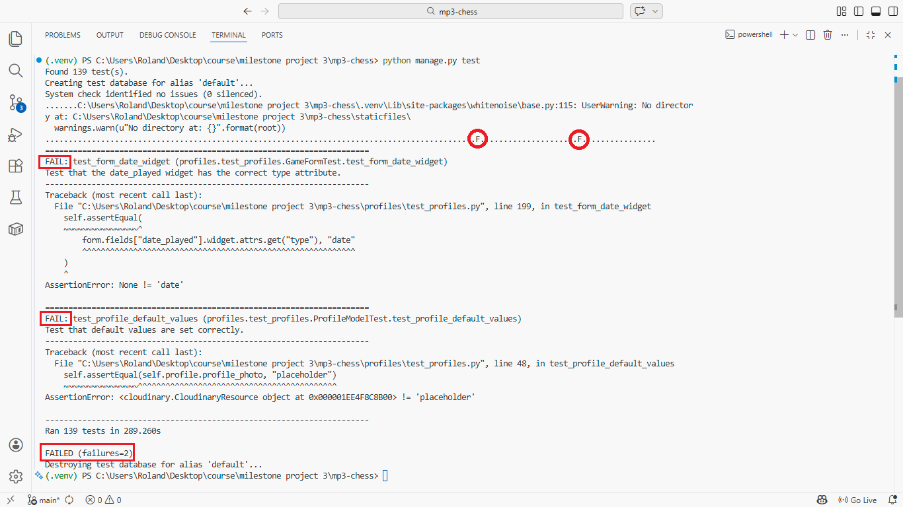

  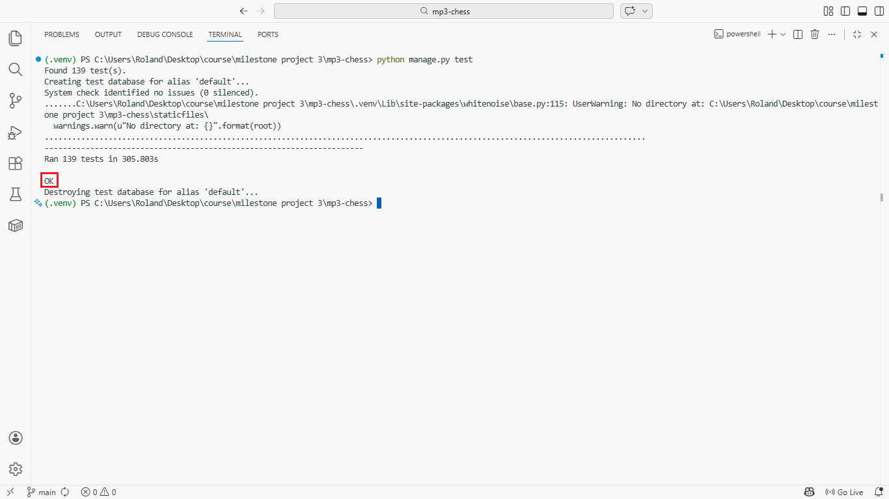

</details>

---

## Code Validation

### Python

All Python files were validated using the [CI Python Linter](https://pep8ci.herokuapp.com/). All files pass with no errors.

| File | Result |
|------|--------|
| club/models.py | ✅ No errors |
| club/views.py | ✅ No errors |
| club/urls.py | ✅ No errors |
| club/forms.py | ✅ No errors |
| club/admin.py | ✅ No errors |
| club/test_club.py | ✅ No errors |
| profiles/models.py | ✅ No errors |
| profiles/views.py | ✅ No errors |
| profiles/urls.py | ✅ No errors |
| profiles/forms.py | ✅ No errors |
| profiles/admin.py | ✅ No errors |
| profiles/signals.py | ✅ No errors |
| profiles/test_profiles.py | ✅ No errors |
| about/models.py | ✅ No errors |
| about/views.py | ✅ No errors |
| about/urls.py | ✅ No errors |
| about/forms.py | ✅ No errors |
| about/admin.py | ✅ No errors |
| about/test_about.py | ✅ No errors |
| chess/settings.py | ✅ No errors |
| chess/urls.py | ✅ No errors |

<details>
  <summary>View Python validation screenshots</summary>

  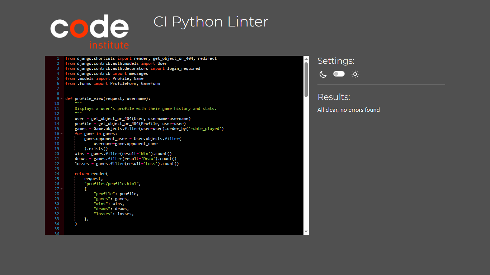

</details>

### HTML

All pages were validated using the [W3C HTML Validator](https://validator.w3.org/) by URL on the deployed site.

| Page | Result |
|------|--------|
| Homepage | ✅ No errors |
| Topic Detail | ✅ No errors |
| About | ✅ No errors |
| Profile | ✅ No errors |
| Login | ✅ No errors |
| Signup | ✅ No errors |
| Logout | ✅ No errors |
| Search Results | ✅ No errors |

<details>
  <summary>View HTML validation screenshots</summary>

  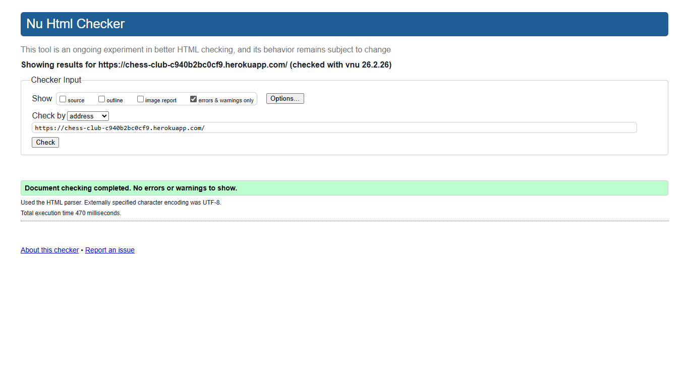

  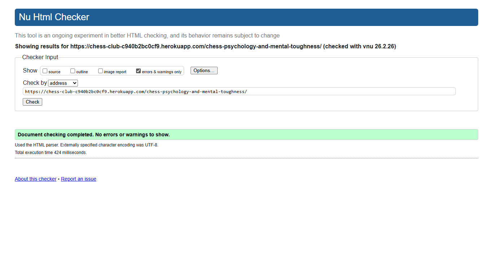

  

  

  

  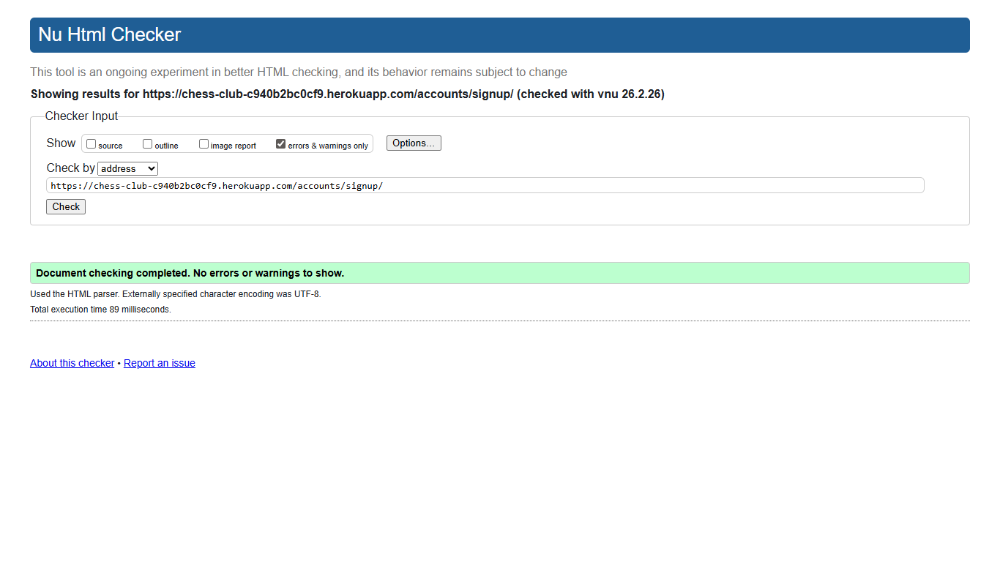

  
  
  

</details>

### CSS

CSS was validated using the [W3C CSS Validator](https://jigsaw.w3.org/css-validator/). No errors found.

<details>
  <summary>View CSS validation screenshot</summary>

  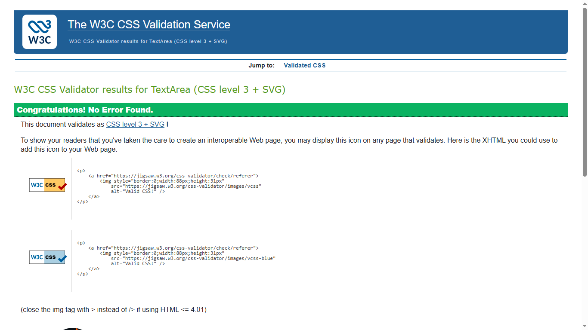

</details>

### JavaScript

JavaScript was validated using [JSHint](https://jshint.com/) with ES6 configured. No errors found. One undefined variable (`bootstrap`) which is loaded externally from the Bootstrap CDN.

<details>
  <summary>View JavaScript validation screenshot</summary>
  
  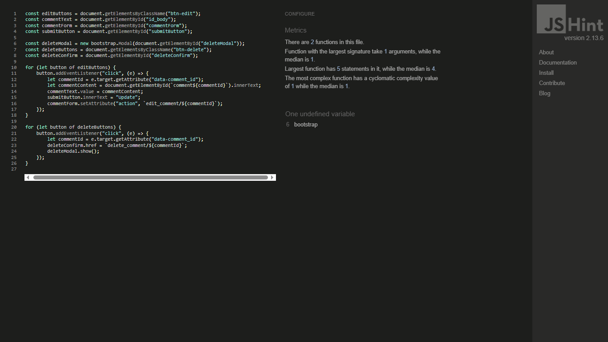

</details>

---

## Manual Testing

### Feature Testing

| Feature | Action | Expected Result | Result |
|---------|--------|----------------|--------|
| Homepage | Load page | Topics displayed in cards with images, pagination works | ✅ Pass |
| Topic Detail | Click topic | Full article with image, votes, and comments displayed | ✅ Pass |
| Search | Enter keyword and search | Matching topics displayed, message if none found | ✅ Pass |
| About Page | Load page | Club info displayed, contact form collapses/expands | ✅ Pass |
| Contact Form | Submit form | Message saved, success alert shown, form resets | ✅ Pass |
| Auto-dismiss Alerts | Trigger any message | Alert fades out after 3 seconds | ✅ Pass |

### Authentication Testing

| Feature | Action | Expected Result | Result |
|---------|--------|----------------|--------|
| Register | Submit signup form | Account created, profile auto-created, redirected to home | ✅ Pass |
| Login | Submit login form | Logged in, success message, redirected | ✅ Pass |
| Login from article | Click login link on article | After login, redirected back to same article | ✅ Pass |
| Logout | Confirm logout | Logged out, success message | ✅ Pass |
| Show Password | Click show password button | Password field toggles between hidden and visible | ✅ Pass |

### CRUD Testing

**Comments:**

| Action | Expected Result | Result |
|--------|----------------|--------|
| Create | Comment appears below article, success message | ✅ Pass |
| Read | Comments displayed with author and date | ✅ Pass |
| Update | Edit button populates form, comment updates on save | ✅ Pass |
| Delete | Confirmation modal shown, comment removed on confirm | ✅ Pass |

**Games:**

| Action | Expected Result | Result |
|--------|----------------|--------|
| Create | Game logged, appears in game history with date picker | ✅ Pass |
| Read | Game history table shows opponent, date, result with colours | ✅ Pass |
| Update | Edit form pre-fills, game updates on save | ✅ Pass |
| Delete | Confirmation prompt, game removed | ✅ Pass |

**Profile:**

| Action | Expected Result | Result |
|--------|----------------|--------|
| Read | Profile displays photo, bio, skill level, stats | ✅ Pass |
| Update | Edit form pre-fills, profile updates including photo | ✅ Pass |
| Delete Account | Confirmation modal, account and all data removed | ✅ Pass |

**Voting:**

| Action | Expected Result | Result |
|--------|----------------|--------|
| Upvote | Vote count increases, button highlighted | ✅ Pass |
| Downvote | Vote count increases, button highlighted | ✅ Pass |
| Toggle off | Click same vote again, vote removed | ✅ Pass |
| Switch vote | Click opposite vote, switches from up to down or vice versa | ✅ Pass |

### Defensive Testing

| Test | Expected Result | Result |
|------|----------------|--------|
| Edit another user's profile | Error message, redirected | ✅ Pass |
| Edit another user's game | Error message, redirected | ✅ Pass |
| Delete another user's comment | Error message, not deleted | ✅ Pass |
| Access profile edit while logged out | Redirected to login | ✅ Pass |
| Access log game while logged out | Redirected to login | ✅ Pass |
| Vote while logged out | Vote buttons disabled, no action | ✅ Pass |
| Comment while logged out | "Log in to leave a comment" shown with link | ✅ Pass |
| Refresh after posting comment | No duplicate comment (POST redirect) | ✅ Pass |
| Refresh after submitting contact form | No duplicate submission (POST redirect) | ✅ Pass |

---

## Responsive Design Testing

The site was tested across multiple screen sizes to ensure proper layout and functionality.

| Device | Result |
|--------|--------|
| Desktop (1920x1080) | ✅ All layouts correct |
| Laptop (1366x768) | ✅ All layouts correct |
| Tablet (768x1024) | ✅ Cards stack correctly, navigation collapses |
| Mobile (375x667) | ✅ Single column layout, images stack properly, topic images appear above article on mobile |

<details>
  <summary>View responsive design screenshots</summary>

  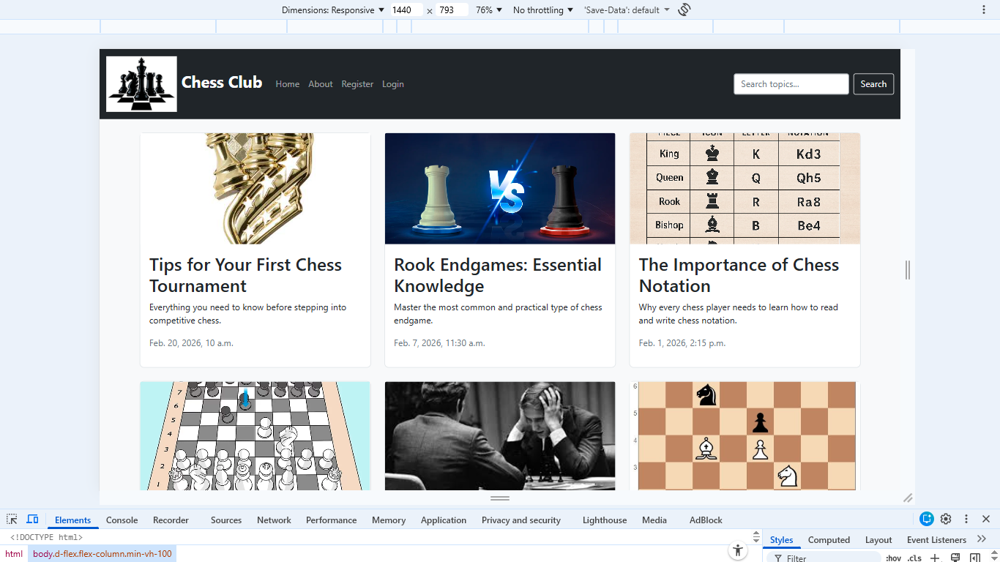

  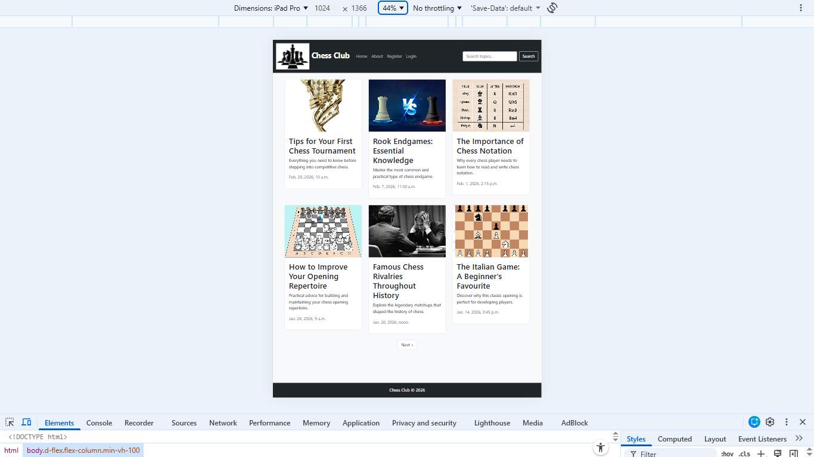

  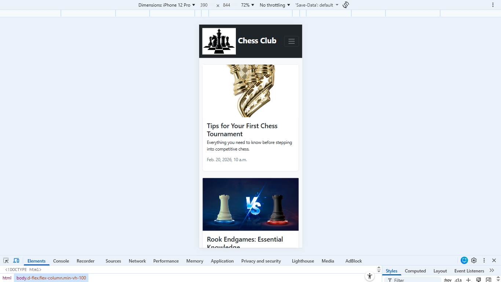

</details>

---

## Browser Compatibility

| Browser | Result |
|---------|--------|
| Google Chrome | ✅ Full functionality |
| Mozilla Firefox | ✅ Full functionality |
| Microsoft Edge | ✅ Full functionality |
| Safari | ✅ Full functionality |

---

## Lighthouse Testing

Google Chrome Lighthouse was used to test performance, accessibility, best practices, and SEO.

<details>
  <summary>Desktop Results</summary>

  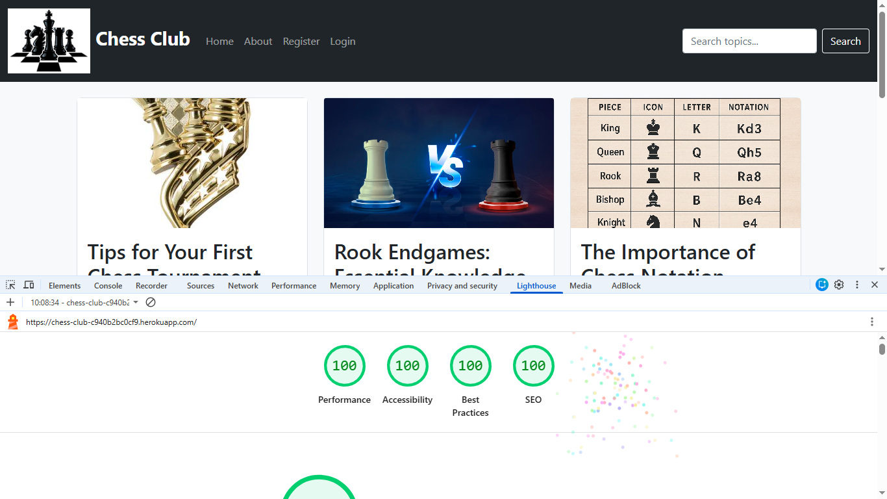

</details>

<details>
  <summary>Mobile Results</summary>

  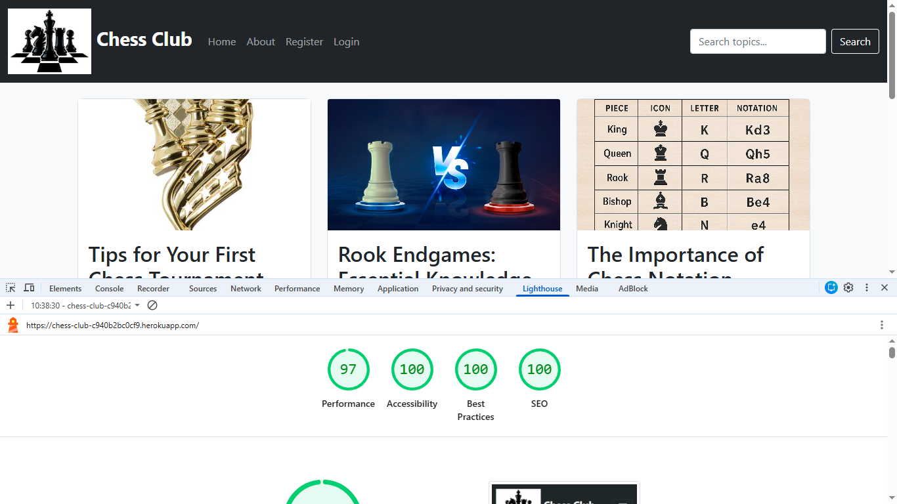

</details>

---

## Known Bugs

- **Opponent name matching** — the clickable opponent feature in game history relies on the opponent name exactly matching a registered username. There is no autocomplete or dropdown, so users must type the username precisely for the link to work.
- **Info message on HTML validation** — W3C validator shows an info message about trailing slashes on void elements. This is a non-error informational notice and does not affect functionality.

---

[← Back to README](README.md)
